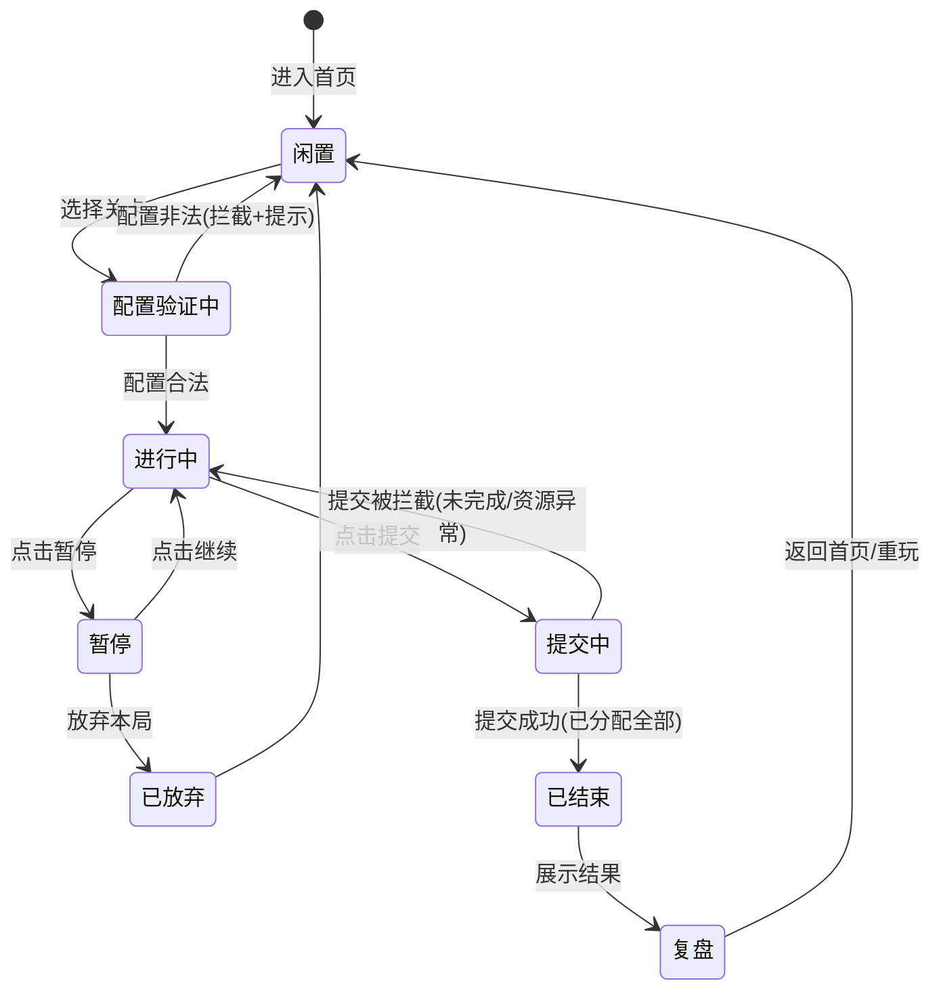
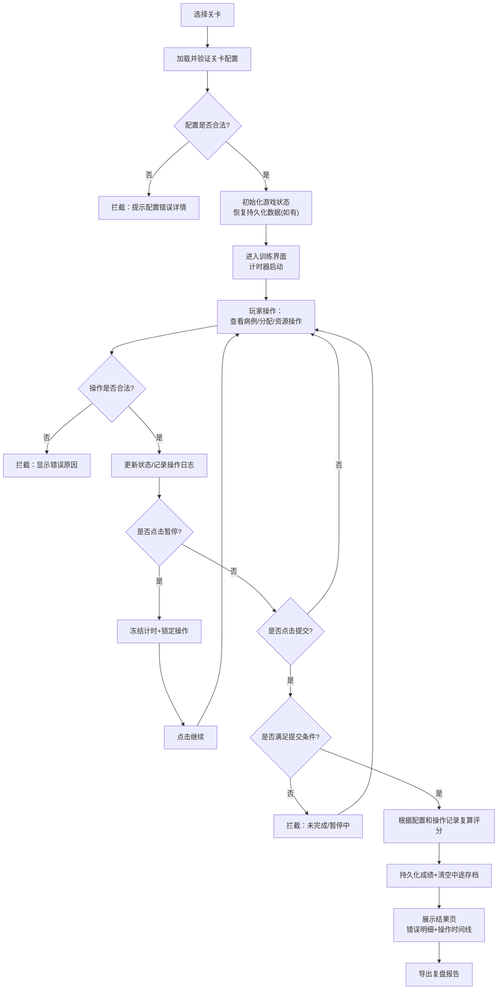

## 1. 产品概述
急救分诊训练小游戏是一款面向医护人员和应急救援人员的本地培训工具，通过模拟真实急救场景中的分诊流程，训练玩家在时间压力和资源限制下快速、准确地将患者分配到红（紧急）、黄（危重）、绿（轻症）、黑（死亡/无望）四个通道的能力。

- 核心目标：提供沉浸式、可复现的分诊训练体验，帮助学员掌握分诊标准操作流程
- 目标用户：急诊科医护人员、院前急救人员、应急救援队伍、医学专业学生
- 产品价值：无需真实患者即可反复练习，评分可追溯复算，复盘支持经验沉淀

## 2. 核心功能

### 2.1 功能模块
1. **关卡选择页**：关卡列表、难度标签、历史最高分展示、继续未完成局面入口
2. **训练主界面**：病例卡展示、生命体征面板、资源槽区域、患者队列、四色通道分配区、计时器、操作控制栏
3. **结果页**：总分展示、分项得分、错误明细、操作时间线、评分复算依据
4. **历史记录页**：成绩列表、筛选查询、复盘详情查看、成绩导出

### 2.2 页面详情

| 页面名称 | 模块名称 | 功能描述 |
|-----------|-------------|---------------------|
| 关卡选择页 | 关卡卡片 | 展示关卡名称、版本、描述、难度、患者数量、限时、最高分、通关状态 |
| 关卡选择页 | 继续游戏 | 检测本地持久化的未完成局面，一键恢复进入 |
| 关卡选择页 | 历史成绩入口 | 跳转至历史成绩列表 |
| 训练主界面 | 顶部状态栏 | 关卡名称、计时器、当前分数、进度指示、暂停/继续按钮 |
| 训练主界面 | 病例卡面板 | 当前选中患者的主诉、病史、过敏史、受伤机制等文本信息 |
| 训练主界面 | 生命体征面板 | HR、BP、SpO2、GCS、呼吸频率、体温等数值及异常高亮 |
| 训练主界面 | 资源槽区域 | 可消耗资源卡片（急救包、除颤仪、气道管理等），显示剩余数量，点击消耗/归还 |
| 训练主界面 | 患者队列 | 所有待分诊患者缩略卡片，显示编号、简要标签、当前分配状态 |
| 训练主界面 | 四色通道区 | 红/黄/绿/黑四个通道区域，支持拖放或点击分配，显示已分配患者列表 |
| 训练主界面 | 操作控制 | 暂停、提交答案、确认结束、放弃本局 |
| 训练主界面 | 错误提示浮层 | 实时显示分诊错误、资源不足、非法操作等拦截原因 |
| 结果页 | 总分仪表盘 | 总分、准确率、平均响应时间、资源利用率等关键指标 |
| 结果页 | 错误明细 | 每个患者的正确答案、玩家答案、扣分原因、评分规则引用 |
| 结果页 | 操作时间线 | 按时间顺序记录所有操作（分配、改判、资源消耗、暂停等） |
| 结果页 | 复盘导出 | 导出 JSON/文本格式的完整复盘报告 |
| 结果页 | 操作按钮 | 返回首页、重玩本关、查看历史 |
| 历史记录页 | 成绩列表 | 按时间倒序展示每局成绩：日期、关卡、版本、分数、准确率、用时 |
| 历史记录页 | 筛选查询 | 按关卡、难度、日期范围筛选 |
| 历史记录页 | 复盘详情 | 点击查看单局完整复盘数据 |

## 3. 核心流程

### 3.1 主流程描述
玩家从首页选择关卡 → 系统加载配置并验证合法性 → 进入训练界面，计时器启动 → 玩家浏览患者病例/体征 → 消耗/归还资源 → 将患者拖入或点击分配到对应通道 → 可随时暂停（暂停时计时冻结且禁止操作）→ 全部患者分配完成后提交 → 系统校验所有分配与资源消耗 → 计算评分 → 展示结果与错误反馈 → 导出复盘数据 → 成绩持久化。

### 3.2 状态流转图

### 3.3 核心业务流程图

## 4. 用户界面设计

### 4.1 设计风格
- **主色调**：医疗专业感配色——深邃蓝 (#1e3a5f) 为主色，搭配四色通道标准色：红 (#dc2626)、黄 (#f59e0b)、绿 (#16a34a)、黑 (#1f2937)
- **辅助色**：冰蓝 (#38bdf8) 强调、银灰 (#cbd5e1) 分隔、纯白背景卡片
- **按钮风格**：圆角 8px，微阴影，悬停上浮 2px + 阴影加深；禁用态 40% 透明度
- **字体**：标题使用 Noto Sans SC Bold，正文使用 Noto Sans SC Regular；数字使用等宽字体 JetBrains Mono
- **布局风格**：顶部状态栏固定 + 三栏栅格（左：病例/体征 40%、中：资源槽+患者队列 30%、右：四色通道 30%），卡片式容器，虚线边框指示拖放区域
- **图标风格**：使用 Lucide 线性图标，尺寸统一 18px，与文字基线对齐
- **氛围细节**：通道区域背景渐变+微弱发光；计时器最后 30s 脉冲红色闪烁；错误提示滑入动画；病例卡翻页动效

### 4.2 页面设计概览

| 页面名称 | 模块名称 | UI 元素 |
|-----------|-------------|-------------|
| 关卡选择页 | 关卡卡片网格 | 卡片悬浮上浮、难度角标、进度条、最高分徽章 |
| 训练主界面 | 顶部状态栏 | 玻璃态背景、倒计时数字脉冲、分数滚动 |
| 训练主界面 | 病例卡 | 翻转卡片正面病例/背面体征、标签式生命体征异常高亮 |
| 训练主界面 | 资源槽 | 堆叠式资源卡片、数量徽标、消耗时缩小动画 |
| 训练主界面 | 患者队列 | 横向滚动缩略卡片、选中态发光描边 |
| 训练主界面 | 四色通道 | 渐变色背景 + 虚线边框、已分配患者标签、hover 高亮目标区 |
| 训练主界面 | 错误提示 | 右下侧滑入 Toast、错误代码 + 描述 + 操作建议 |
| 结果页 | 总分仪表盘 | 环形进度条 + 数字动画、星级评定 |
| 结果页 | 错误明细表格 | 斑马行、正确/错误对比色块、规则引用折叠面板 |
| 历史记录页 | 成绩表格 | 可排序列、筛选抽屉、展开查看复盘详情 |

### 4.3 响应式设计
- **桌面端优先**：≥1280px 三栏布局，≤1024px 折叠为上下布局（病例区在上，资源+通道在下），≤768px 单列卡片堆叠，患者队列改为纵向
- **触摸优化**：拖放改为点击选中 + 点击通道两步操作；按钮最小点击区域 48×48px
