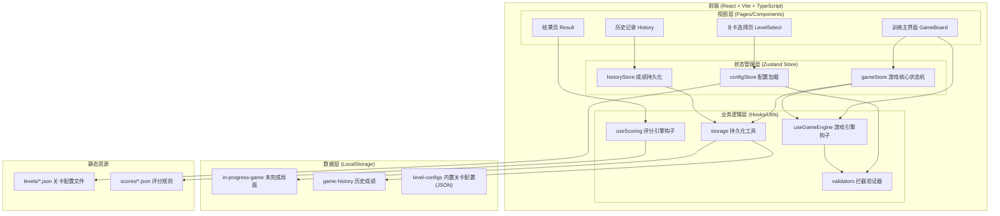

## 1. 架构设计



## 2. 技术描述

- **前端框架**：React@18 + TypeScript@5 + Vite@5
- **状态管理**：Zustand@4（轻量级、支持中间件持久化）
- **样式方案**：TailwindCSS@3 + CSS Modules 混合 + 原生 CSS 变量实现主题
- **图标库**：Lucide React（线性图标，轻量可摇树）
- **拖放交互**：@dnd-kit/core + @dnd-kit/sortable（无障碍、触摸友好）
- **数据校验**：Zod（关卡配置、操作合法性运行时校验）
- **持久化**：原生 localStorage + Zustand persist 中间件 + 自定义序列化
- **路由**：React Router DOM@6（SPA 多页面切换）
- **初始化方式**：npm create vite@latest triage-trainer -- --template react-ts

## 3. 路由定义

| 路由路径 | 页面组件 | 页面用途 |
|-----------|-----------|-----------|
| `/` | LevelSelectPage | 关卡选择首页，展示可选关卡与继续游戏入口 |
| `/game/:levelId` | GameBoardPage | 训练主界面，执行分诊操作 |
| `/result/:sessionId` | ResultPage | 本局评分结果与复盘展示 |
| `/history` | HistoryPage | 历史成绩列表与复盘查询 |
| `*` | NotFoundPage | 404 兜底页 |

## 4. 数据模型

### 4.1 实体关系图

```mermaid
erDiagram
    LEVEL {
        string id PK "关卡ID"
        string name "关卡名称"
        string version "配置版本号(语义化)"
        string description "场景描述"
        enum difficulty "难度EASY/MEDIUM/HARD"
        number timeLimitSeconds "限时(秒)"
        Patient[] patients "患者列表"
        ResourceSlot[] resourceSlots "资源槽配置"
        ScoringRules scoringRules "评分规则"
    }

    PATIENT {
        string id PK "患者ID"
        number sequenceNo "队列序号"
        string name "匿名代号"
        string age "年龄"
        string gender "性别"
        string chiefComplaint "主诉"
        string history "既往病史"
        string allergies "过敏史"
        string injuryMechanism "受伤机制"
        VitalSigns vitalSigns "生命体征"
        string[] tags "标签(快速识别)"
        Channel correctChannel "正确通道 R/Y/G/B"
        string reasoning "正确答案依据"
        ResourceRequirement[] requiredResources "推荐资源消耗"
    }

    VITAL_SIGNS {
        number hr "心率bpm"
        string bp "血压收缩压/舒张压"
        number spo2 "血氧饱和度%"
        number gcs "GCS评分"
        number respRate "呼吸频率次/分"
        number temperature "体温℃"
    }

    RESOURCE_SLOT {
        string id PK "资源ID"
        string name "资源名称"
        string icon "图标名"
        number initialCount "初始数量"
        string description "用途说明"
        boolean consumable "是否消耗型"
    }

    GAME_SESSION {
        string id PK "会话ID(UUID)"
        string levelId FK "关联关卡"
        string levelVersion "关卡版本快照"
        enum status "状态IDLE/RUNNING/PAUSED/ENDED/ABANDONED"
        number startTime "开始时间戳"
        number elapsedSeconds "已用时(秒)"
        number remainingSeconds "剩余秒数"
        string selectedPatientId "当前选中患者"
        Record assignments "患者ID→通道映射"
        Record resourceUsage "资源ID→已用量"
        ActionLog[] operationLog "操作日志"
        ErrorRecord[] errors "错误记录"
    }

    ACTION_LOG {
        number timestamp "毫秒时间戳"
        string type "类型 ALLOCATE/DEALLOCATE/RESOURCE/PAUSE/RESUME/SUBMIT"
        string patientId "关联患者"
        string fromChannel "原通道"
        string toChannel "目标通道"
        string resourceId "关联资源"
        string note "备注"
    }

    SCORING_RULES {
        number correctScore "单次正确得分"
        number channelWrongPenalty "通道错误扣分"
        number severityMismatchPenalty "严重等级偏差扣分"
        number resourceMissPenalty "缺资源扣分"
        number resourceOverusePenalty "资源滥用扣分"
        number timeoutPenaltyPerSec "超时每秒扣分"
        number pausePenalty "每次暂停扣分(可选0)"
        number perfectChannelBonus "通道全对奖励"
        number resourceEfficiencyBonus "资源效率奖励"
    }

    GAME_RECORD {
        string id PK "成绩ID"
        string levelId "关卡ID"
        string levelName "关卡名快照"
        string levelVersion "关卡版本"
        number totalScore "总分"
        number maxScore "满分"
        number accuracy "准确率"
        number usedSeconds "用时"
        boolean completed "是否完成"
        number createdAt "完成时间戳"
        string sessionSnapshot "完整会话快照JSON(用于复盘)"
    }
```



### 4.2 核心 TypeScript 类型定义

```typescript
// 通道枚举
export type Channel = 'RED' | 'YELLOW' | 'GREEN' | 'BLACK';
export const CHANNEL_LABEL: Record<Channel, string> = {
  RED: '红色（紧急）', YELLOW: '黄色（危重）', GREEN: '绿色（轻症）', BLACK: '黑色（死亡）'
};

// 游戏状态枚举
export type GameStatus = 'IDLE' | 'RUNNING' | 'PAUSED' | 'ENDED' | 'ABANDONED';
export type ActionType = 'ALLOCATE' | 'DEALLOCATE' | 'RESOURCE_USE' | 'RESOURCE_RETURN'
  | 'PAUSE' | 'RESUME' | 'SUBMIT' | 'SELECT_PATIENT';

// 操作日志
export interface ActionLog {
  timestamp: number;
  type: ActionType;
  patientId?: string;
  fromChannel?: Channel | null;
  toChannel?: Channel | null;
  resourceId?: string;
  note?: string;
}

// 错误记录
export interface ErrorRecord {
  code: string;
  message: string;
  suggestion: string;
  patientId?: string;
  channel?: Channel;
  resourceId?: string;
  timestamp: number;
}

// 评分细节
export interface ScoringDetail {
  patientId: string;
  correctChannel: Channel;
  assignedChannel: Channel;
  score: number;
  baseScore: number;
  penalties: { type: string; amount: number; reason: string }[];
  bonuses: { type: string; amount: number; reason: string }[];
}

export interface ScoreResult {
  total: number;
  maxScore: number;
  accuracy: number;
  details: ScoringDetail[];
  resourceScore: number;
  timeScore: number;
  finalPenalty: number;
  finalBonus: number;
  recalcProof: { ruleKey: string; input: unknown; output: number }[];
}
```

## 5. 核心模块与拦截机制

### 5.1 配置校验模块 (validators/levelConfigValidator.ts)
- 使用 Zod schema 校验 JSON 关卡配置
- 必查项：字段缺失、类型错误、范围越界（如 GCS 3-15、SpO2 0-100）
- 业务一致性：患者 ID 唯一、资源槽 ID 唯一、correctChannel 必须为四色之一
- 拦截输出：错误列表含行级定位（字段路径）与修正建议

### 5.2 运行时操作拦截器 (validators/runtimeValidator.ts)
| 拦截场景 | 错误码 | 判定条件 |
|-----------|--------|-----------|
| 暂停时操作 | E_PAUSED_LOCKED | status === PAUSED 且执行分配/资源操作 |
| 结束后修改答案 | E_GAME_ENDED | status === ENDED/ABANDONED 且尝试变更 |
| 资源不足 | E_RESOURCE_DEPLETED | 资源剩余量 ≤ 0 且请求消耗 |
| 重复提交 | E_ALREADY_SUBMITTED | 已存在 SUBMIT 日志且再次提交 |
| 提交未完成 | E_NOT_ALL_ASSIGNED | patients.some(p => !assignments[p.id]) |
| 非法患者/通道 | E_INVALID_TARGET | patientId 或 channel 不存在 |
| 归还未消耗资源 | E_RESOURCE_NOT_USED | 归还量 > 已消耗量 |

### 5.3 状态机 (store/gameStore.ts)
```
IDLE →(startGame)→ RUNNING →(pause)→ PAUSED →(resume)→ RUNNING
RUNNING →(submit且校验通过)→ ENDED
RUNNING/PAUSED →(abandon)→ ABANDONED
ENDED/ABANDONED 为终态，所有变更操作 throw E_GAME_ENDED
```

### 5.4 持久化策略
- **未完成局面**：每 2 秒自动保存 `gameStore.$state` 到 localStorage key `triage:in-progress`，附加版本号与时间戳；页面加载时检查并在首页显示"继续游戏"按钮；提交成功或放弃时自动清除
- **历史成绩**：提交成功后推入 localStorage key `triage:history` 数组（上限 200 条，超量淘汰最旧），索引按 levelId + createdAt
- **恢复一致性**：恢复时二次校验关卡版本，版本不一致提示"关卡已更新，恢复可能不准确"，并强制重算剩余时间 = max(0, 原始剩余 - 离开时长)

### 5.5 评分复算引擎
- 纯函数 `calculateScore(levelConfig: Level, session: GameSession): ScoreResult`
- 输出包含 `recalcProof` 数组，记录每条规则的输入与输出，供结果页展示"依据"
- 结果页支持"重新复算"按钮，用同一份配置 + 会话快照再次执行并比对结果，保证可追溯性

## 6. 目录结构

```
src/
├── assets/                 # 静态资源
├── components/
│   ├── layout/            # TopBar, Container, Toast
│   ├── game/              # PatientCard, VitalsPanel, ResourceSlot, ChannelZone, PatientQueue
│   ├── result/            # ScoreGauge, ErrorTable, Timeline, ExportButtons
│   └── common/            # Button, Modal, Badge, Tag
├── pages/
│   ├── LevelSelectPage.tsx
│   ├── GameBoardPage.tsx
│   ├── ResultPage.tsx
│   └── HistoryPage.tsx
├── store/
│   ├── gameStore.ts       # Zustand 游戏状态机 + persist
│   ├── configStore.ts     # 关卡配置加载缓存
│   └── historyStore.ts    # 历史成绩 CRUD
├── hooks/
│   ├── useGameEngine.ts   # 计时、状态流转、操作封装
│   ├── useScoring.ts      # 评分计算
│   ├── useCountdown.ts    # 倒计时钩子
│   └── useDragAllocate.ts # 拖放分配封装
├── validators/
│   ├── levelConfigValidator.ts  # Zod schemas + validateLevel()
│   └── runtimeValidator.ts      # 运行时操作拦截
├── utils/
│   ├── storage.ts         # localStorage 封装 + 版本检查
│   ├── scoring.ts         # 评分核心算法（纯函数）
│   ├── export.ts          # 复盘 JSON/TXT 导出 + 下载
│   └── uuid.ts
├── config/
│   └── levels/            # 内置关卡 .json 文件
│       ├── basic-emergency.json
│       ├── mass-casualty.json
│       └── pediatric-triage.json
├── types/
│   └── index.ts           # 全局类型定义
├── App.tsx
├── main.tsx
└── index.css
```
